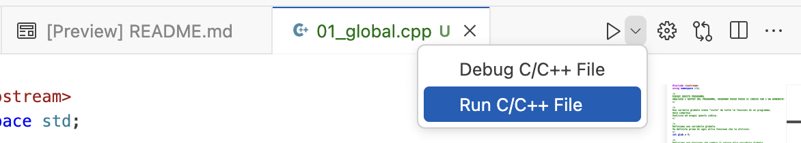

# Istruzioni
- Aprire il file 01_global.cpp
- Eseguire il programma dal tasto run, come in figura:

- in TERMINAL, ANALIZZARE L'OUTPUT DEL PROGRAMMA, SEGUENDO PASSO PASSO IL CODICE CHE L'HA GENERATO!

Ripetere la stessa procedura per i programmi: 
   - 02_local.cpp
   - 03_local_mod.cpp
   - 04_local_reference.cpp
   - 05_riassunto.cpp
